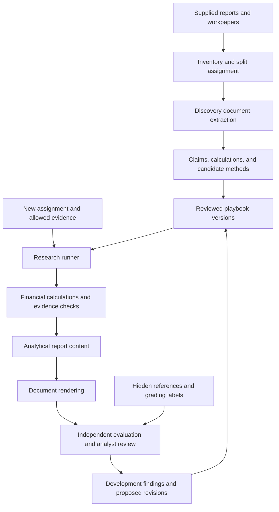

# Equity Research Agent Lab: Research and Implementation Handoff

### Navigation

- [Mission and scope](#1-mission-and-scope)
- [Research findings and prior work](#2-research-findings-and-relevant-prior-work)
- [First implementation session](#4-first-implementation-session)
- [Report intake](#5-report-intake-and-corpus-design), [extraction](#6-document-extraction-and-visual-inspection), and [analytical reconstruction](#7-reconstruct-the-reports-analytical-argument)
- [Reusable playbooks](#8-build-a-reusable-playbook) and [analyst review](#9-analyst-review-and-knowledge-elicitation)
- [Architecture](#10-proposed-local-architecture), [data contracts](#11-data-contracts), and [tools](#12-tools-and-financial-data-access)
- [Experiments](#15-experimental-design), [evaluation](#16-evaluation-framework), and [leakage controls](#17-leakage-time-and-historical-validity)
- [Financial validity and worked fixture](#18-financial-modeling-validity)
- [Review interface](#19-review-interface), [rendering](#20-document-design-and-report-rendering), and [reproducibility](#21-traces-replay-and-reproducibility)
- [Tests](#22-test-strategy-and-failure-fixtures), [roadmap](#23-implementation-roadmap), and [repository design](#24-repository-and-command-line-design)
- [Budgets](#25-budgets-and-execution-controls), [backlog](#28-prioritized-implementation-backlog), and [open research tasks](#29-open-research-work-for-the-implementation-agent)
- [Copy-ready starting instruction](#30-copy-ready-starting-instruction-for-the-implementation-agent)
- [Sources and reading priorities](#31-sources-and-reading-priorities)

## 1. Mission and scope

Build a local testing lab that investigates whether professional equity research reports can be converted into reusable research methods, document specifications, and agent workflows. The initial inputs will be a small collection of reports supplied by the project owner. Supporting spreadsheets, earlier versions, source packets, and analyst feedback may become available later.

The central research question is:

> Can a workflow inferred from example reports produce more accurate, analytically useful research on new assignments than a strong general-purpose agent given the same tools, data, and resource budget?

The lab must make this question measurable. Its first product is an inspectable experiment: source reports, extracted evidence, proposed research rules, generated work, and an honest comparison of results. A polished report is one output of that experiment.

### 1.1 Intended capability

The desired system should eventually:

1. Inspect reports as both visual documents and analytical arguments.
2. Identify the questions, evidence, calculations, assumptions, and judgments behind their conclusions.
3. Distinguish explicit evidence from plausible reconstruction and unknown information.
4. Derive reusable rules with clear conditions and limits.
5. Translate those rules into executable research workflows with appropriate tools.
6. Research a new assignment, maintain a financial model, and generate a report.
7. Show where its conclusions came from and where its work remains incomplete.
8. Test changes against baselines and preserve evidence of both improvements and regressions.

### 1.2 First-version boundary

The confirmed priority is a **local lab for inspecting reports, testing workflows, and reviewing results**. Start with one report family and one manageable analytical task. Expand only after the first comparison is usable.

Do not make the first milestone depend on enterprise deployment, user accounts, a cloud database, trading connectivity, fine-tuning, a large multi-agent organization, or a perfect PDF renderer. Those may be evaluated later if observed needs justify them.

Local operation means that the application, source storage, experiment records, and review interface run locally. It does not imply that a hosted model API processes data locally. Make the selected model route and data handling visible in configuration.

### 1.3 Deliverables expected from the implementation agent

- A working repository with a documented local setup and offline fixture mode.
- A report inventory and a reviewed extraction sample.
- An evidence-linked analysis of at least one supplied report when reports are available.
- A versioned candidate playbook with uncertain rules clearly marked.
- A minimal workflow that completes a bounded research assignment.
- A controlled baseline comparison and an error analysis.
- A local review interface or review bundle that exposes sources, calculations, and disagreements.
- A prioritized next-experiment plan based on the results.

### 1.4 Evidence versus proposal

Section 2 summarizes external research and its limitations. The architecture, schemas, operating rules, thresholds, and implementation sequence in the remaining sections are **proposed lab design choices**. They are starting hypotheses, not demonstrated results or established industry standards. Revise them when the supplied reports and experiments provide contrary evidence.

No project reports have been supplied or analyzed for this handoff. All company examples and numerical examples below are illustrative. No claim is made that the lab has already been implemented or validated.

## 2. Research findings and relevant prior work

The sources were checked on September 14, 2026, America/New_York time. Research papers, repository releases, and software documentation have different evidentiary roles: a paper can motivate a method; a repository can demonstrate available code; neither establishes performance on this project's reports without replication.

### 2.1 Closest precedents

| Work | What the source establishes | Implication for this lab |
|---|---|---|
| **FinReportBench** | A 2026 preprint describes expert-derived report evaluation and reusable instructions refined from observed failures. Its benchmark separates public assignments from reconstructed research trajectories and hidden source material. | Closely related to the proposed evaluation-and-playbook loop. Inspect its criteria, but develop analytical checks specific to the supplied reports. [Paper](https://arxiv.org/html/2608.04374v1) |
| **FinReportBench public repository** | The inspected release contains query cards. It explicitly excludes source documents, research packs, scripted trajectories, model outputs, and evaluation artifacts. | This is not an immediately reproducible, complete lab. Use available tasks selectively; budget for constructing the missing local evidence and evaluation assets. [Repository](https://github.com/MisterBrookT/finreportbench) |
| **FinRpt** | Proposes an equity-report dataset, a generation framework, and multiple evaluation metrics. Dataset construction includes model-generated reports, expert-report refinement, and a correction step tied to realized direction labels. | Useful task and evaluation reference. Outcome-conditioned construction is unsuitable as an unmodified test of research quality using only contemporaneous information; that is a design inference from its construction procedure. [Paper, dataset construction](https://arxiv.org/html/2511.07322v1) |
| **FinSight** | Describes financial research with executable analysis, persistent variable memory, chart refinement, and staged writing. Its repository exposes an implementation and report pipeline. | Inspect reusable source-to-analysis and rendering patterns. Test their cost and dependencies before adopting the framework. [Paper](https://arxiv.org/abs/2510.16844), [repository](https://github.com/RUC-NLPIR/FinSight) |
| **FinRobot** | Provides an open financial-agent platform and an equity-research/valuation design. | A useful comparison implementation and source of connector ideas. Its existence does not establish that it recovers a particular analyst's methodology. [Equity research paper](https://arxiv.org/abs/2411.08804), [repository](https://github.com/AI4Finance-Foundation/FinRobot) |

FinReportBench's study emphasizes institutional delivery and observable document criteria. Its reported improvements should not be interpreted as proof of superior forecasts, recovered analyst cognition, or reliable investment decisions. Its initial expert sample is small, and the public release limits independent reproduction. This lab should measure the business-driver analysis and financial dependencies directly, alongside presentation. [FinReportBench](https://arxiv.org/html/2608.04374v1)

### 2.2 Benchmarks for individual capabilities

| Resource | Appropriate use | Boundary |
|---|---|---|
| **FinQA** | Tests numerical reasoning over financial reports with annotated calculation programs. | Component testing; not a test of complete equity research. [Paper](https://aclanthology.org/2021.emnlp-main.300/) |
| **TAT-QA** | Tests questions requiring financial tables and associated text. | Useful for evidence joins and units; does not establish investment judgment. [Paper](https://aclanthology.org/2021.acl-long.254/) |
| **FinanceBench** | Financial question answering with answers and evidence. The repository exposes a 150-case sample of the larger benchmark. | Verify the available subset and terms. Historical reported model scores do not describe current models. [Paper](https://arxiv.org/abs/2311.11944), [repository](https://github.com/patronus-ai/financebench) |
| **Finance Agent** | Financial research questions answered through tools, including filing search. | Useful task patterns. The repository documents gated access to its evaluation platform, so do not assume all execution services are freely available. [Repository](https://github.com/vals-ai/finance-agent) |
| **FinSearchComp** | Separates time-sensitive fetching, historical lookup, and complex historical investigation. | Useful retrieval task taxonomy. Search quality and report quality need separate measurement. [Paper](https://arxiv.org/abs/2509.13160) |
| **FinReasoning** | Separates semantic consistency, data alignment, and deeper analytical insight. | Useful failure categories; validate any adopted rubric against the project's analysts and report types. [Paper](https://arxiv.org/abs/2603.19254) |

Use public benchmarks as component diagnostics and external stress tests. Keep the project's primary success criteria grounded in new local assignments and analyst review. Public datasets may overlap model training data and may represent different markets, languages, tasks, and professional conventions.

### 2.3 Agent architecture and optimization

Anthropic's architecture guidance distinguishes predefined workflows from model-directed agents and recommends starting with simple, composable systems. Its evaluation guidance distinguishes task outcomes from execution traces and combines programmatic, model, and human grading. These support a small, observable lab with bounded adaptive research, rather than an elaborate architecture chosen before the failure modes are known. [Architecture](https://www.anthropic.com/engineering/building-effective-agents), [evaluation](https://www.anthropic.com/engineering/demystifying-evals-for-ai-agents)

DSPy provides a research precedent for optimizing modular language-model programs against explicit metrics. It becomes relevant after stable task splits and trustworthy evaluation exist. It is not a substitute for defining what financial quality means. [DSPy paper](https://arxiv.org/abs/2310.03714)

Agent Laboratory demonstrates a general research-assistant workflow spanning literature, experiments, and reporting. It is adjacent prior work for organizing experiments, rather than evidence for reconstructing sell-side research methods. [Paper](https://arxiv.org/abs/2501.04227)

### 2.4 Document extraction and output contracts

Docling provides a structured document representation with text, tables, pictures, hierarchy, layout coordinates where available, and provenance. It is a candidate for retaining the relationships that plain PDF-to-text conversion loses. Benchmark it on the actual reports. [Document model](https://docling-project.github.io/docling/concepts/docling_document/), [technical paper](https://arxiv.org/abs/2501.17887)

pdfplumber exposes detailed PDF geometry, table extraction, and visual debugging, and describes itself as most suitable for machine-generated PDFs. It is a useful lightweight baseline and diagnostic fallback. [Official repository](https://github.com/jsvine/pdfplumber)

Structured model outputs can constrain the shape of extracted records, but schema compliance does not establish factual correctness. OpenAI's documentation explicitly notes that structured outputs can still contain mistakes. Validate evidence and financial relationships independently. [Official OpenAI documentation](https://developers.openai.com/api/docs/guides/structured-outputs)

### 2.5 Important limitations of reconstruction

A report is an incomplete observation of a production process. It may contain a persuasive presentation of selected results, without failed searches, abandoned models, editorial constraints, or private research. Multiple processes can explain the same artifact. Therefore, the project can infer and test useful procedures; it cannot establish the original author's private mental sequence from the artifact alone.

There is a related caution for generated explanations: research has demonstrated that models can produce plausible explanations that do not faithfully identify influences on their answers. Store observable actions, source references, calculations, and concise decision summaries. Do not use a long generated inner monologue as proof that the proposed procedure was executed. [Turpin et al.](https://arxiv.org/abs/2305.04388)

Citation quality also requires two questions: whether claims have support, and whether each citation actually supports its claim. Research on generative search distinguishes these dimensions. A URL count is insufficient. [Liu et al.](https://aclanthology.org/2023.findings-emnlp.467/)

## 3. Research questions and falsifiable hypotheses

Create a research register before optimizing prompts. Give each hypothesis a test, an alternative explanation, and a decision consequence.

| ID | Hypothesis | Test | What a negative result means |
|---|---|---|---|
| H1 | Reports contain reusable analytical procedures beyond their layout. | Compare a learned analytical playbook with style-only examples on unseen assignments. | The first corpus may mainly encode presentation, or the inference method may be weak. |
| H2 | Explicit workflow rules improve quality beyond simply supplying examples. | Compare examples-in-context with a compiled playbook under matched tools and budgets. | Keep retrieval/examples as the simpler solution unless another benefit is demonstrated. |
| H3 | The learned rules add value beyond a competent generic finance checklist. | Compare learned and generic finance workflows with the same execution structure. | Avoid crediting domain scaffolding to report-specific learning. |
| H4 | Evidence and calculation dependencies reduce unsupported conclusions. | Remove dependency tracking while keeping the writer and evidence access fixed. | The graph may be too costly or poorly used; simpler records may suffice. |
| H5 | Analyst feedback improves rule validity and transfer. | Compare automatic rules with expert-corrected rules on a separate assignment. | The questions or review interface may fail to elicit useful judgments. |
| H6 | Adaptive follow-up research adds value beyond a fixed checklist. | Give both workflows the same maximum budget and measure resolved material uncertainties. | Prefer the simpler workflow for this task family. |
| H7 | Rules transfer beyond the original company or reporting period. | Use distinct company and time-based test tracks. | Restrict the playbook's documented scope. |
| H8 | Style improvements can be separated from analytical improvements. | Judge neutral text/model bundles and styled reports separately. | Revisit the evaluation design if presentation dominates all results. |

A positive result is bounded by the report family, data access, model configuration, reviewer population, and task sample tested. A few successful outputs establish feasibility, not broad reliability.

For every architectural decision, record: options considered, evidence, chosen default, unresolved risk, and a condition that would justify changing the decision.

## 4. First implementation session

### 4.1 Actions that can proceed immediately

1. Inspect the target workspace, existing instructions, available runtimes, and current files.
2. Create a small repository structure and a decision log.
3. Implement fixture-only ingestion and the core data contracts.
4. Implement a deterministic calculation example and a failing-source example.
5. Define the first experimental comparison before adding more agent roles.
6. Build a static local review bundle if a live interface would delay the first useful review.

Do not claim that real-report extraction or methodology inference is complete until actual reports have been processed and reviewed. If the reports have not arrived, finish the infrastructure and show the exact input directory and accepted formats.

### 4.2 Questions to resolve from the reports or existing context

- What report family dominates: initiation, earnings preview, earnings reaction, thematic note, or valuation update?
- Are the examples from one analyst/team or multiple sources?
- Is the goal to reproduce one analyst's preferences or combine several approaches?
- Are associated spreadsheets, source documents, or drafts available?
- Can a finance professional review a few concrete examples?
- Which model/data routes are already available, and what run budget applies?

Infer routine choices from the inventory. Ask only for decisions that materially affect the experiment. Continue independent setup while awaiting answers. A missing analyst interview should reduce confidence in inferred rules, not prevent basic extraction experiments.

### 4.3 Practical defaults

Use one user, local files, a Python application, SQLite metadata, JSON/JSONL artifacts, a configurable model adapter, and a CLI. Add a small local review UI after the first end-to-end fixture works. Start with one base model so architecture changes can be evaluated without simultaneously changing the model.

Choose a supported Python version after checking parser and model-client compatibility on the host. Pin dependency versions in a lockfile. Do not introduce a GPU requirement unless the actual document parser requires it and the benefit has been measured.

## 5. Report intake and corpus design

### 5.1 Preserve the originals

Copy supplied documents into a managed input area without modifying the originals. Compute a SHA-256 hash, record the original filename, and assign a stable document ID. Store parser outputs separately from source files.

Record:

- Report title, publisher, analyst/team if present, company identifiers, and sector.
- Publication date and time when available, including time zone and confidence.
- Report family, language, page count, and available supporting files.
- Whether the PDF contains native text, scans, mixed content, or restrictions.
- Apparent relationships to earlier reports, earnings events, and workbook versions.
- Source-access or redistribution constraints already supplied with the material.
- Dataset role: discovery, development, locked evaluation, or archive.

Document properties and filenames can be wrong. Preserve them as observations until reconciled with the visible report header or another reliable source.

### 5.2 Select a coherent starting group

Prefer a few comparable reports over a random mixture. Reports from the same team about the same sector may expose consistent procedures. Reports before and after an event may expose forecast revisions. A workbook can reveal dependencies absent from the prose.

If only one report arrives, build the extraction and reconstruction case study. Do not report transfer performance. If a few reports arrive, reserve an entire report or assignment when possible and label the results exploratory. If all initial material must be used for discovery, obtain a genuinely new assignment before claiming generalization.

### 5.3 Split before learning from content

Use metadata to assign corpus roles before detailed methodology extraction. Cluster duplicate PDFs, revisions, near-duplicate notes, and report series so that related artifacts do not accidentally cross a split intended to test independence.

Two distinct holdout designs are useful:

- **New-company transfer:** reserve companies and closely related report groups.
- **Future-update transfer:** permit earlier reports as legitimate historical context, but hide the future report and all later information.

Do not combine those results into one unlabeled score. The second test intentionally permits longitudinal context; the first asks a broader transfer question.

The reference report for an evaluation assignment belongs to the evaluator, not the generator. If an implementation agent has already read the reference, use a fresh, isolated model session for generation. Removing text from a prompt does not undo prior exposure in an ongoing conversation.

### 5.4 Treat reports as fallible references

The report can establish what the analyst wrote. It does not automatically establish that the analyst's forecast, source interpretation, or arithmetic was correct. Preserve two separate assessments:

1. Reconstruction fidelity: does the lab accurately represent the report?
2. Research validity: do its statements and calculations hold up against evidence?

A faithful reproduction of a flawed calculation should pass the first test and fail the second.

## 6. Document extraction and visual inspection

### 6.1 Use a layered parsing strategy

Run a lightweight native-text/geometry extraction baseline and a structured parser on a representative sample. Escalate difficult pages to OCR or a vision-capable model when necessary. Do not assume one parser wins across every page.

Preserve an intermediate document representation with:

- Page identity, dimensions, rotation, and printed page labels.
- Text blocks, headings, reading order, and their bounding boxes.
- Tables with row/column hierarchy, merged headers, units, notes, and cell coordinates.
- Figures, captions, legends, axis labels, and source footnotes.
- Main content versus headers, footers, and repeated boilerplate.
- Links, footnote relationships, extraction method, and review status.

Keep page renderings available for reviewer inspection. Extracted Markdown is a useful view, but it should not be the only retained representation.

### 6.2 Preserve numerical meaning

Every extracted number needs context. A bare `12.5` is not a usable financial datum. Capture the metric, entity, period, currency/unit, scale, accounting basis, actual/estimate status, and source location.

Explicitly test:

- Parentheses used for negative numbers.
- Millions versus billions and per-share values.
- Percentages versus percentage points or basis points.
- Fiscal years versus calendar years.
- Historical actuals versus current and prior analyst estimates.
- Columns labeled E, A, FY, CY, LTM, NTM, or other source conventions.
- Non-GAAP measures and reconciliation notes.
- Footnotes that change the interpretation of a whole table.

Do not silently normalize away these distinctions. Retain the original displayed value alongside the normalized value and the transformation record.

### 6.3 Charts need explicit treatment

When underlying chart data is available, use it. When only a chart image exists, extract the title, variables, units, dates, legend, and qualitative relationship. Mark visually estimated values as approximate and record the extraction method.

Do not turn a pixel estimate into an apparently exact model input. A chart's analytical purpose may still be recoverable even when its data is not: comparison with peers, evidence of a cycle, forecast sensitivity, or a bridge between assumptions and outcomes.

### 6.4 Parser comparison protocol

Select pages covering the main layouts: cover summary, dense financial table, valuation, multi-column prose, chart page, and footnotes. For a very small corpus, inspect all thesis-critical pages and a representative sample of the rest.

Compare parsers on critical-value accuracy, row/column alignment, reading order, footnote attachment, source-location fidelity, processing time, and correction effort. Do not select a parser based only on attractive Markdown.

Maintain a small human-verified extraction set. Include at least one intentionally difficult table. Manually corrected values must have an audit entry; they must not masquerade as untouched parser output.

## 7. Reconstruct the report's analytical argument

### 7.1 Begin with the report's purpose

For each report, identify its likely audience, decision horizon, trigger, report family, and central question. Mark purpose statements as explicit, inferred, or unknown. An initiation may justify a long-term valuation framework; an earnings reaction may mainly explain changed estimates and near-term implications.

Create a section map. For each section, record what job it performs, what earlier work it depends on, and how it contributes to the investment view. The writing order is not necessarily the research order.

### 7.2 Extract claims into an evidence graph

Represent the argument as typed records and links. A graph here means connected data records; a graph database is unnecessary for the first version.

Useful node types:

- Research question.
- Observed fact or source statement.
- Analyst estimate or assumption.
- Calculation and its inputs.
- Interpretive claim.
- Alternative explanation or contradiction.
- Valuation output.
- Investment conclusion.
- Catalyst, risk, or condition that would change the conclusion.

Useful links include `supports`, `contradicts`, `derived_from`, `assumes`, `compares_with`, `updates`, and `would_invalidate`. Use `causes` only when the evidence and analysis justify a causal interpretation. Do not upgrade ordinary association into causality.

### 7.3 Classify the status of each reconstruction

Use separate fields for these two dimensions:

| Dimension | Values | Meaning |
|---|---|---|
| Origin | observed, inferred, proposed | Directly present in the source; inferred about its process; or a new lab recommendation. |
| Verification | verified, partially_verified, unverified, contradicted, not_applicable | Whether the relevant source claim or calculation has been checked. |

Also record whether the content is a fact, forecast, assumption, judgment, or unknown. An observed forecast is still a forecast. An unverified company statement can be accurately transcribed without being independently established.

Avoid unsupported numerical confidence scores such as 0.93. Start with qualitative confidence and a short evidence-based explanation. Calibrate numerical confidence only if enough labeled examples become available.

### 7.4 Reconstruct calculations before guessing procedures

When a report contains a target price, estimate table, or valuation bridge:

1. Transcribe the visible inputs and output.
2. Identify the stated formula or plausible formulas.
3. Recompute the output using deterministic code.
4. Record rounding differences and missing inputs.
5. Preserve competing explanations when more than one method fits.

For example, EPS multiplied by a P/E multiple may reproduce a target price. That establishes a plausible valuation identity. It does not establish why the analyst chose that EPS forecast, that multiple, or that horizon.

Do not reverse-fit invisible assumptions simply to make an output match. If an implied multiple is calculated from price divided by EPS, label it as an implied value rather than an independently justified valuation input.

### 7.5 Infer candidate research actions

For every material claim, ask what observable work would be required to support it on a new assignment. Translate the answer into a candidate action with an input, output, and check.

Example: a report compares supplier commentary with customer investment plans. The candidate action is to collect dated statements from both groups, align time periods and definitions, identify disagreements, and explain the consequences for the forecast. The candidate action is not “use supplier commentary because the original report did.”

Keep alternative procedures where reasonable. A report could have used a detailed operating model, a top-down market estimate, or an external forecast. Test which procedure is both feasible with available inputs and useful on new cases.

### 7.6 Produce a report dissection bundle

Each discovery report should yield:

- A structural map and style summary.
- A list of major questions and conclusions.
- Claims with source locations and verification status.
- Recomputed financial relationships.
- An evidence and dependency map.
- Candidate workflow steps and their uncertainty.
- Missing workpapers or sources that would resolve important ambiguity.
- A short set of questions for expert review.

## 8. Build a reusable playbook

### 8.1 Keep different types of knowledge separate

Use separate modules for:

1. Report-family requirements.
2. Sector-specific drivers and definitions.
3. Analyst/team preferences.
4. Source selection and evidence standards.
5. Financial modeling and valuation procedures.
6. Writing and document design.
7. Verification and stopping conditions.

This separation lets the lab test whether an improvement came from analytical rules, stronger data, or presentation. It also prevents a particular company's facts from becoming universal instructions.

### 8.2 Rule format

Every rule should contain:

- A stable ID, version, name, and purpose.
- When it applies and when it does not.
- Required inputs and source quality requirements.
- Actions and allowable alternatives.
- Expected outputs and validation checks.
- What to do when inputs are missing or conflicting.
- Supporting report locations or expert feedback.
- Origin, confidence, review status, and known counterexamples.
- Experiments in which the rule helped, harmed, or had no measurable effect.

Example rule, expressed in plain language:

> When updating a forecast after earnings, reconcile the old estimate, reported actual, new guidance, and revised estimate on the same period and accounting basis. Explain material changes through operating drivers. If no prior estimate is available, record that gap and avoid describing the new number as a revision.

This is a proposed generic rule. It becomes a report-derived rule only when the discovery evidence supports that attribution.

### 8.3 Learn conditional weighting

Do not infer importance from word frequency, chart size, or the number of citations alone. A brief observation may drive most of the forecast revision, while several pages provide context.

Investigate importance through:

- Explicit statements of materiality.
- Changes between report versions.
- Model sensitivities and scenario differences.
- Which facts change estimates, valuation, or the investment view.
- Expert comparisons between otherwise similar cases.

Represent conditional priorities before trying to learn numerical weights. For example, distinguish evidence about near-term revenue timing from evidence about long-term market size. Do not treat those sources as interchangeable votes.

### 8.4 Compile the playbook into executable units

Use a readable methodology file, machine-readable task definitions, prompt templates, tool contracts, and validation functions. Each workflow step should declare its dependencies and output schema.

Compile only the applicable modules into a run. A short relevant instruction set is easier to inspect and ablate than an ever-growing universal prompt. Keep the generic financial baseline distinct from inferred analyst-specific additions.

## 9. Analyst review and knowledge elicitation

Analyst time is scarce. Prepare concrete artifacts before requesting review. A claim, source excerpt, model bridge, or pair of competing outputs produces more actionable feedback than “How do you write research?”

Useful review questions include:

- Which of these two evidence-supported conclusions is more useful, and why?
- Which missing question would make you reject this report?
- Does this source change your forecast, confidence, or neither?
- What additional information would resolve this disagreement?
- Which assumption is doing most of the work in this valuation?
- Which condition would make this method inappropriate?
- Is this a general rule, a sector convention, or a decision specific to this case?

Ask about a few important decisions at a time. Store feedback as an attributed observation with scope and date. Preserve disagreements between experts; do not silently average incompatible investment philosophies.

If the original author is unavailable, another qualified reviewer can evaluate usefulness, but cannot certify the original author's actual process. Record the distinction.

Maintain a correction taxonomy: extraction error, missing evidence, wrong definition, calculation error, unjustified assumption, weak materiality judgment, omitted alternative, poor organization, or formatting defect. The taxonomy should guide the next experiment.

## 10. Proposed local architecture

### 10.1 Components

Use one application with clearly separated modules:

| Component | Responsibility | Durable output |
|---|---|---|
| Corpus manager | Inventory, hashing, duplicate grouping, access policy, and split assignment | Document manifests |
| Ingestion pipeline | Parse documents and retain visual/source coordinates | Structured documents, page images, tables |
| Reconstruction module | Map claims, calculations, questions, and candidate procedures | Dissection bundles |
| Playbook registry | Version, scope, review, and select reusable rules | Methodology and workflow specifications |
| Evidence service | Search/fetch only allowed data and retain provenance | Source snapshots and normalized facts |
| Calculation engine | Evaluate explicit financial formulas | Input/output lineage and validation results |
| Research runner | Execute the selected workflow with bounded adaptation | Run state, findings, and decision summaries |
| Report renderer | Render approved analytical content and charts | Markdown, HTML, and optional PDF |
| Evaluation runner | Grade frozen outputs and compare variants | Scores, issues, and experiment summaries |
| Review interface | Let analysts inspect and correct work | Review events and labeled examples |

These are software responsibilities, not a requirement for ten independently acting agents. The first implementation can use one model adapter and sequential functions.

### 10.2 Data flow



The diagram's feedback path applies to development cases. A locked evaluation produces an evaluation report; its detailed feedback must not feed further tuning while the same cases continue to be described as untouched tests.

### 10.3 Storage and boundaries

Use SQLite for searchable metadata and relationships. Store larger immutable artifacts as files addressed by content hash. JSONL is suitable for append-only events and exported records. SQLite tables should refer to artifact IDs rather than contain redundant copies of long documents.

Maintain separate stores or namespaces for:

- Discovery reports and inferred rules.
- Task-allowed evidence.
- Run outputs and temporary state.
- Hidden evaluator references and labels.
- Human review events.

Enforce these boundaries in tool implementations. Do not rely on a prompt asking the model not to read a folder it can access. During a locked test, expose only the task's allowlisted artifacts to the generator process. Avoid giving it a general host-filesystem tool.

### 10.4 Runtime choices

The default is a small Python state machine with typed inputs and outputs. If branching, resumption, and checkpoint management become cumbersome, evaluate LangGraph; its documentation describes persistent checkpoints and SQLite-backed checkpoint options. A checkpoint replay can re-execute model and API calls, so cached-output replay must be a separately defined lab mode. [LangGraph persistence](https://docs.langchain.com/oss/python/langgraph/persistence)

PydanticAI is another candidate for typed model interactions and provider abstraction. Evaluate it with the same small workflow before adopting it. Do not install several orchestration frameworks to postpone the choice. [Official documentation](https://pydantic.dev/docs/ai/overview/)

OpenAI's agent evaluation documentation describes using traces to diagnose behavior and datasets to compare changes repeatedly. Regardless of provider, keep the lab's core traces and evaluation records exportable locally. [Official OpenAI documentation](https://developers.openai.com/api/docs/guides/agent-evals)

### 10.5 Build versus reuse

Reuse parsers, model clients, HTML rendering, plotting, and storage libraries. Implement the report-specific evidence schema, rule registry, financial definitions, experiment controls, and analyst review protocol within the lab.

Before importing a large financial-agent repository, inspect its data-provider assumptions, credentials, operating-system requirements, code-execution scope, output provenance, license files, and evaluation accessibility. Run a small bounded example before deciding to integrate it. Importing a project is not evidence that its published quality claims transfer.

## 11. Data contracts

The following records are proposed interfaces. Implement them as typed models with schema versions, validation, and migration tests. Use the examples to guide implementation; they are not a complete production schema.

### 11.1 Document and source records

```json
{
  "schema_version": "1.0",
  "document_id": "doc_example_001",
  "content_sha256": "REPLACE_WITH_ACTUAL_SHA256",
  "original_filename": "example_report.pdf",
  "role": "discovery",
  "report_family": "earnings_update",
  "company_ids": ["synthetic_company"],
  "publisher": null,
  "published_at": null,
  "publication_time_confidence": "unknown",
  "ingested_at": "2026-09-14T20:00:00-04:00",
  "page_count": 8,
  "source_policy_id": "local_private_v1",
  "related_document_ids": [],
  "parser_artifact_ids": [],
  "review_status": "pending"
}
```

The placeholder hash above must fail production validation. Missing dates remain null; do not invent midnight or infer a publication date from the filesystem modification time.

Source snapshots additionally need canonical URL or private file reference, publisher, retrieval time, publication/availability evidence, content hash, acquisition method, and access status. Preserve a source's parent document and any quoted secondary source.

### 11.2 Evidence spans

An evidence span must identify a stable source location: document hash, PDF page index, printed page label when present, bounding box, and table/cell or text-block ID. Define coordinates explicitly; for example, normalized top-left coordinates with x and y between 0 and 1.

Record extraction text, a short excerpt for display, and a pointer to the full source. Keep OCR confidence separate from claim validity. A perfectly recognized sentence can still contain an unsupported assertion.

### 11.3 Normalized financial facts

```json
{
  "schema_version": "1.0",
  "fact_id": "fact_demo_revenue_fy2025",
  "entity_id": "synthetic_company",
  "metric": "revenue",
  "value": "1200.0",
  "displayed_value": "1,200.0",
  "unit": "USD",
  "scale": "million",
  "period_start": "2025-01-01",
  "period_end": "2025-12-31",
  "period_type": "fiscal_year",
  "accounting_basis": "reported",
  "value_type": "actual",
  "scenario": null,
  "source_span_ids": ["span_demo_01"],
  "available_at": "2026-02-20T07:00:00-05:00",
  "verification_status": "verified",
  "supersedes_fact_id": null
}
```

Use Decimal-compatible strings for financial values where exact decimal arithmetic matters. Carry uncertainty intervals for approximate values. Use separate records for different definitions, sources, restatements, or estimate vintages rather than overwriting one field.

Metric definitions must be versioned. `free_cash_flow`, for example, requires a formula and treatment of relevant adjustments. A familiar label is not a sufficient definition.

### 11.4 Claims and calculations

Claims need:

- Claim ID, text, type, entity, horizon, and materiality.
- Origin and verification status.
- Supporting and contradicting evidence IDs.
- Required calculation IDs and assumption IDs.
- Scope qualifiers and unresolved questions.
- Where the claim appears in the generated report.

Calculations need:

- Formula identifier and version.
- Named input fact/assumption IDs.
- Units, period rules, and rounding policy.
- Output values and units.
- Execution status, warnings, and lineage.
- Reconciliation tolerance and validation result.

Prefer a registry of financial operations and a restricted expression representation to arbitrary `eval`. Generated calculation code, if introduced later, belongs in an isolated execution environment with a defined input/output contract.

### 11.5 Workflow rules

```yaml
schema_version: '1.0'
rule_id: earnings_revision_bridge
version: 1
origin: proposed
status: experimental
applies_when:
  report_family: earnings_update
requires:
  - reported_actuals
  - current_guidance
optional_inputs:
  - prior_estimates
  - consensus_snapshot
steps:
  - align_periods_units_and_accounting_basis
  - calculate_comparable_changes
  - explain_changes_using_supported_business_drivers
outputs:
  - estimate_bridge
  - material_change_explanations
  - unresolved_input_gaps
checks:
  - arithmetic_recomputes
  - comparable_definitions
  - no_revision_claim_without_prior_estimate
on_missing_prior_estimates: label_new_forecast_without_revision_comparison
supporting_report_span_ids: []
expert_review_ids: []
```

A rule with no supporting report spans is allowed as a proposed generic baseline. It must not be counted as successfully inferred from a report.

### 11.6 Assignments and experiment configurations

```yaml
schema_version: '1.0'
task_id: synthetic_earnings_case_01
report_family: earnings_update
entity_id: synthetic_company
as_of: '2026-03-01T16:00:00-05:00'
audience: equity_research_analyst
question: Explain the change in earnings expectations and valuation sensitivity.
evaluation_track: supplied_evidence
allowed_source_manifest: manifests/synthetic_case_01.json
required_sections:
  - key_changes
  - operating_drivers
  - estimate_bridge
  - valuation_sensitivity
  - risks_and_unresolved_questions
required_outputs:
  - report.md
  - claims.jsonl
  - calculations.jsonl
  - source_register.jsonl
excluded_outputs:
  - trading_orders
output_word_budget: 1500
playbook_version: generic_v1
```

Store hidden reference paths and grading answers in a separate evaluator-only configuration. Do not include them in a generator-readable task object, even if the generator is instructed to ignore them.

Run configurations additionally need model/provider identifiers, generation parameters, workflow and prompt hashes, budget limits, permitted tools, retrieval configuration, replicate number, and the experiment protocol version.

### 11.7 Evaluation and review records

Every evaluation item should store its definition, applicability, result, supporting evidence, grader type/version, and reviewer overrides. Distinguish a failed criterion from a criterion that could not be assessed.

An expert correction should preserve the old value, proposed replacement, reason, source, reviewer identity or pseudonymous ID, and timestamp. Store corrections as new events so previous experiment outputs remain reproducible.

## 12. Tools and financial data access

### 12.1 Minimum tool set

| Tool | Inputs | Outputs | Required behavior |
|---|---|---|---|
| `search_evidence` | Query, entity, period, allowed corpus | Ranked evidence IDs and excerpts | Filter by task permissions and time policy before returning content |
| `read_source_span` | Evidence ID and optional context radius | Source content with location | Return exact provenance and preserve neighboring qualifications |
| `inspect_page` | Document ID and page | Page image and mapped blocks | Support visual verification of tables and footnotes |
| `get_financial_facts` | Entity, metric, period, basis, vintage | Typed facts and conflicts | Never silently combine incompatible definitions |
| `run_calculation` | Registered operation and input IDs | Results, units, lineage, checks | Deterministic, validated execution |
| `record_finding` | Structured claim and evidence links | Stored claim ID and validation | Require explicit assumptions or gaps where support is incomplete |
| `render_chart` | Data artifact, chart spec, source references | Chart image and data link | Use the same approved numbers as the report |
| `validate_report` | Report and claim/calculation artifacts | Issues with locations and severity | Check citations, numbers, consistency, and completeness |

Keep retrieval and computation separate. A function that returns a prose answer containing numbers is harder to audit than a function returning typed facts with provenance.

### 12.2 Add external sources in stages

Start with supplied reports and a manually curated source packet. Then add public filings and company materials. Add licensed estimates, transcripts, pricing, and industry data only when the selected task needs them and access exists.

The SEC provides public submissions and extracted XBRL APIs without API keys. Its documentation describes company identifiers, updates, bulk data, and limitations of aggregated XBRL facts. A current Company Facts response is not itself a point-in-time snapshot; use filing accession and availability evidence to select the correct vintage. Company-specific dimensions may require reading the underlying filing. [SEC API documentation](https://www.sec.gov/search-filings/edgar-application-programming-interfaces)

Implement caching, an identifying client header where required, respectful request pacing, and error handling according to the provider's current documented access requirements. Recheck provider requirements during implementation rather than hardcoding a policy copied from an old tutorial.

### 12.3 Facts public sources may not supply

Do not assume public filings contain historical consensus estimates, proprietary channel checks, transcript licenses, detailed product mix, management-access notes, or all competitor data. An analyst's advantage may depend on such inputs.

If a required input is unavailable, label the resulting analytical limitation and narrow the task. For example, describe a change relative to company guidance when a dated consensus snapshot is unavailable; do not relabel guidance as consensus.

### 12.4 Retrieval strategy

Start with metadata filters and lexical search over a small corpus. Add semantic retrieval only if observed misses justify it. Use hybrid retrieval as an experimental variant rather than a prerequisite.

Retrieve coherent evidence units: a table with headers and notes, a paragraph with its qualifiers, or a chart with its caption. Preserve parent-child relationships so a retrieved sentence can be expanded to its original context.

Deduplicate by document identity and source lineage. Five articles repeating the same company announcement are not five independent observations.

## 13. Model use and prompt contracts

### 13.1 Choose models by measured needs

Use configurable role names such as `extractor`, `researcher`, `writer`, and `reviewer`. They may initially point to the same model. Record actual provider IDs and settings in each run manifest.

Test a capable model first on a small real case. Introduce a cheaper extraction or review model only after measuring its errors. Do not assume a model branded for finance is better at this corpus, and do not hardcode a current leaderboard winner into the architecture.

### 13.2 Extraction prompt contract

The extractor receives the source content and an explicit schema. It must return source-linked observations, distinguish forecasts from facts, retain qualifiers, and use null/unknown fields when information is absent. It must not fill missing facts from memory.

For difficult pages, provide both the image and extracted text, and require the output to identify conflicts between them. Schema errors and factual errors need separate handling.

### 13.3 Reconstruction prompt contract

The reconstruction stage receives an approved report dissection and relevant source spans. It proposes research actions that could produce the analytical result, labels them as hypotheses, supplies alternative explanations, and identifies evidence needed to discriminate among them.

It must not claim to know the original analyst's internal thoughts. Request concise decision rationales and observable work products rather than unrestricted chain-of-thought transcripts.

### 13.4 Research prompt contract

The researcher receives the assignment, applicable rules, tool catalog, allowed evidence boundary, and budget. It produces questions, findings, calculations, and unresolved issues before drafting prose.

Give it explicit conditions for further research: conflicting material facts, missing model inputs, a thesis-critical unsupported claim, or a plausible alternative that changes the conclusion. Require it to stop when the relevant questions are resolved or the remaining gaps cannot be addressed within the configured resources.

### 13.5 Writer and reviewer contracts

The writer receives approved findings, calculations, and a report specification. It may organize and explain them, but any new substantive claim must return to the research/verification path.

The reviewer receives the assignment, source evidence, calculations, and draft. It should identify specific defects with evidence and severity. A reviewer that merely rewrites prose is not providing independent validation.

Use a separate final evaluation context from the workflow's internal reviewer. The latter helps produce the output; the former measures the frozen result.

## 14. Initial workflow recipes

### 14.1 Recipe A: report dissection

1. Confirm document identity and discovery-set status.
2. Parse and inspect critical pages.
3. Map sections and analytical purpose.
4. Extract claims, facts, assumptions, and calculations.
5. Recompute visible relationships.
6. Map support, contradictions, and missing links.
7. Propose a small set of candidate research rules.
8. Produce a review bundle with source locations.

Completion means the dissection is inspectable and its uncertainties are visible. It does not mean the inferred procedure has been validated.

### 14.2 Recipe B: evidence-backed analytical section

Start generation with a section such as an estimate revision bridge, a business-driver analysis, or a valuation sensitivity. This is small enough to inspect thoroughly and exercises real reasoning.

1. Read the assignment and required evidence types.
2. Collect and align the necessary facts.
3. Build calculations and assumptions.
4. Evaluate at least one material alternative explanation where applicable.
5. Write the section using linked findings.
6. Check arithmetic, definitions, citations, and missing qualifications.
7. Freeze the output for comparison.

Do not require an arbitrary number of sources or alternatives when the question is already resolved. The criterion is decision relevance, not activity count.

### 14.3 Recipe C: complete narrow report

After section-level behavior works, combine the components into a report family selected from the actual corpus. For an earnings update, a reasonable candidate sequence is assignment framing, results reconciliation, operating-driver analysis, estimate bridge, valuation implications, risks, drafting, and verification.

The sequence remains a hypothesis. If the examples demonstrate that valuation or scenario framing should guide research earlier, test that ordering rather than preserving the default because it was implemented first.

### 14.4 Bounded repair

Classify issues before retrying:

- A missing source triggers targeted retrieval.
- A period/basis mismatch triggers normalization repair.
- A calculation error triggers recomputation.
- A weak inference triggers revision or removal of the claim.
- A layout issue triggers rendering repair.
- An unavailable proprietary input produces a visible gap.

Use a small configurable repair limit, initially at most two substantive repair rounds. Preserve the original draft and each revision. If a critical issue remains, return a failed or incomplete lab result with evidence rather than a falsely successful report.

## 15. Experimental design

### 15.1 Establish a fair comparison ladder

| Variant | Inputs and behavior | Question answered |
|---|---|---|
| B0: minimal request | Short request plus ordinary tool access | How large is the original underspecification problem? Diagnostic only. |
| B1: strong general agent | Clear assignment, same data/tools, competent generic instructions | What does a reasonable general agent achieve? |
| B2: examples in context | B1 plus permitted discovery examples or retrieved exemplars | Does providing reports directly solve most of the problem? |
| B3: generic finance workflow | Explicit domain checklist and staged execution, without learned report-specific rules | How much benefit comes from ordinary domain engineering? |
| B4: inferred playbook | Same execution structure as B3 plus applicable report-derived rules | Do the inferred rules add value? |
| B5: expert-corrected playbook | B4 with documented analyst corrections | What does targeted expert input contribute? |

B0 is intentionally weak and must not be the only comparator. The central comparisons are B4 against B2 and B3, with B1 retained as a practical reference.

### 15.2 Separate data gathering from reasoning and writing

Run two tracks:

1. **Supplied-evidence track:** every variant receives access to the same frozen evidence packet. This isolates interpretation, calculations, workflow, and writing.
2. **Research track:** every variant receives the same tool capabilities and starting assignment, and gathers its own evidence within the same source/time policy.

In the research track, the evidence actually collected may differ; that is part of the measured behavior. Record it. Do not claim a workflow-only improvement if one arm silently receives a superior paid data feed or additional source packet.

### 15.3 Separate analytical and visual variants

Evaluate content in a neutral presentation first. Then test the renderer and style module using the same approved analytical content. A styled report with more attractive charts should not receive credit for better financial reasoning unless its claims and calculations actually improve.

Likewise, do not discard useful visual analysis. A chart that exposes a material relationship can contribute to analytical usefulness. Distinguish the analytical function of the chart from its decorative styling.

### 15.4 Match resource conditions

For an initial architecture comparison, hold model, tool catalog, evidence policy, output length target, and maximum run budget constant. Record actual consumption rather than assuming equal caps imply equal cost.

Then evaluate quality-versus-cost curves if a more expensive workflow wins. Include inference, retrieval, parsing, repairs, grading, and human intervention. Account separately for one-time playbook construction cost and per-report operating cost.

Prompt lengths may legitimately differ because one variant contains a playbook. Report those differences. Add a context-budget-matched comparison when prompt size could explain the result. Do not pad controls with nonsense text merely to equalize tokens.

### 15.5 Repetition and sample size

Use two or three independent trials per case for an exploratory pilot if the budget permits. More repeats characterize stochastic variability; they do not turn one company into several independent companies.

Report the number of independent assignments, report groups, companies, and trials separately. With very few cases, show paired outcomes and error examples instead of significance claims. Estimate the sample size for a larger study only after observing variance and defining a meaningful improvement.

### 15.6 Ablations

Change one mechanism at a time where feasible:

- Remove style rules while preserving analytical rules.
- Remove report-derived rules while keeping the generic workflow.
- Replace inferred rules with direct exemplars.
- Remove the internal reviewer.
- Replace adaptive retrieval with a fixed source packet.
- Disable dependency tracking while retaining source references.
- Remove expert corrections.
- Swap the model while freezing the playbook.

Document interactions when components cannot be cleanly separated. A rule that requires a tool cannot be fairly tested after removing that tool without recording the dependency.

### 15.7 Predeclare the experiment

Before running a comparison, freeze the assignment list, allowed evidence, variants, budgets, primary measures, critical-failure definitions, and handling of missing data. Store the protocol hash in each run.

If the protocol changes after results are inspected, record the change and treat the rerun as a new experiment. Do not selectively regenerate weak outputs, omit failed runs, or show only the best sample from each variant.

## 16. Evaluation framework

### 16.1 Evaluate four different things

Keep four scorecards:

1. **Extraction:** fidelity to the supplied documents.
2. **Method reconstruction:** plausibility, evidence, scope, and executability of proposed rules.
3. **Research quality:** correctness and usefulness of new analytical work.
4. **Document quality:** clarity and usability of the rendered report.

These answer different questions. Excellent extraction does not validate a research method. Agreement with an original price target does not establish better analysis. A report can disagree with the reference and still be well supported.

### 16.2 Primary research measures

| Measure | Operational definition | Evaluation method |
|---|---|---|
| Critical factual error rate | Material factual claims judged wrong divided by material factual claims assessed | Source-based review with explicit claim inventory |
| Numerical correctness | Correct values, formulas, units, periods, definitions, and displayed rounding | Deterministic checks plus input-definition review |
| Evidence support coverage | Claims requiring external support that are adequately supported divided by all such claims | Independent claim extraction and evidence review |
| Citation precision | Citation-to-claim links that support the attached claim divided by all assessed links | Entailment checks with expert calibration |
| Required-question coverage | Applicable assignment questions answered to the predefined standard | Task checklist with omission review |
| Analytical usefulness | Ability to explain material drivers, alternatives, valuation consequences, and uncertainty | Anchored expert rubric and blinded comparison |
| Correction effort | Expert time and substantive edits needed to reach the agreed review standard | Timed review with issue classifications |
| Resource use | Run cost, elapsed time, tool calls, repairs, and manual intervention | Run telemetry |

Assess factual claims independently of the generator's own claim list. Otherwise, it can omit unsupported sentences from the structured artifact while leaving them in the report. Re-extract claims from the final prose and compare them with the registered inventory.

Support coverage must be paired with required-question coverage. An empty report with no unsupported claims is not successful. Unknown or unavailable critical inputs should produce an incomplete outcome, not a perfect score through denominator removal.

### 16.3 Proposed analytical rubric

Use a 0–4 anchored scale for applicable dimensions. Start with separate scores rather than a single weighted total.

| Dimension | 0 | 2 | 4 |
|---|---|---|---|
| Business drivers | No meaningful drivers or materially wrong interpretation | Relevant drivers listed with partial connections | Evidence-supported mechanism linking drivers to financial consequences |
| Forecast construction | Unsupported numbers or incompatible periods | Reproducible forecast with weak assumption support | Transparent model, justified assumptions, scenarios, and sensitivity |
| Valuation | Unsupported output or broken calculation | Valid calculation with limited rationale | Defensible method, basis, peer/horizon choices, and uncertainty analysis |
| Evidence judgment | Repeats sources indiscriminately | Notes some limitations or disagreements | Resolves or preserves material conflicts with a clear rationale |
| Alternatives and risks | Generic risks with no implications | Relevant risks described | Plausible competing explanation and conditions that change the conclusion |
| Materiality | Trivia dominates or key issue missing | Main issue identified but incompletely prioritized | Focuses research and explanation on what changes the decision |
| Communication | Incoherent or misleading | Understandable but difficult to audit | Clear thesis, evidence, calculations, qualifications, and open questions |

Scores 1 and 3 represent intermediate performance. Define report-family examples for each anchor using development material. Freeze the rubric before locked evaluation. Allow `not_applicable` only when the assignment genuinely excludes a dimension, and require a reason.

Do not hardcode an analyst's preferred recommendation as the correct answer. Judge whether the conclusion follows from supported inputs and acknowledged assumptions. Where several conclusions are defensible, permit them.

### 16.4 Critical checks

The following are proposed prerequisites for a report to be labeled ready for analyst review:

- Every thesis-critical quantitative claim has a valid source or explicit calculation lineage.
- Every thesis-critical calculation recomputes within a documented tolerance.
- No known material entity, currency, period, or accounting-basis mismatch remains.
- No known source outside the permitted information cutoff is used.
- No fabricated source, management quotation, data-provider result, or analyst identity is presented.
- Required output artifacts exist and critical pages are readable.

The target for these checks is complete coverage, not a sampled percentage. Automated tools can miss errors, so “passed automated checks” must be distinguished from “expert reviewed.” Remaining noncritical gaps should be visible in the review summary.

A failure should not erase diagnostic scores. Preserve the issue profile, while preventing an attractive average score from hiding the critical defect.

### 16.5 Evaluate rule quality directly

For a proposed playbook rule, assess:

- Whether its claimed source evidence exists.
- Whether it is a reasonable inference rather than copied company-specific content.
- Whether it has clear applicability and exceptions.
- Whether available tools can execute it.
- Whether its checks are observable.
- Whether an expert accepts it, rejects it, or narrows its scope.
- Whether removing it changes performance on an independent task.

Measure the last item empirically. Agreement between multiple models about a rule is weak evidence if they are drawing on the same ambiguous report.

### 16.6 Blinded analyst comparison

Present outputs from different variants in randomized order with neutral labels. Keep the same assignment, evidence access for the reviewer, and display format. Ask for a preference, a tie, or insufficient evidence to judge, followed by the concrete reasons.

Where possible, have a second reviewer assess a subset. Preserve disagreement rather than forcing artificial consensus. Report whether preferences reflect the project's actual analyst or an external reviewer with a different investment style.

Use model judges for scalable triage after calibrating them against human decisions. Test order sensitivity by swapping output order, and inspect disagreements. Hide variant names and self-promotional language from judges. A separate model family can be a useful sensitivity test, but it is not automatically independent in its errors.

### 16.7 Summarizing comparisons

For ordinal preferences, report wins, ties, losses, and unassessable pairs. An optional preference rate is `(wins + 0.5 * ties) / assessed_pairs`; always publish the raw counts too.

For quantitative scores, calculate paired differences within each assignment, summarize trials within that assignment, and then aggregate across assignments. Do not treat sections or repeated generations as independent companies.

With a larger set of independent report groups, use group-aware uncertainty estimates and report effect sizes. With a tiny pilot, emphasize individual cases, repeated-run variability, and bounded conclusions. Do not manufacture statistical confidence through excessive resampling of a few examples.

## 17. Leakage, time, and historical validity

### 17.1 Define what the model may know

An assignment needs both a research date and an information cutoff. A fiscal period end is not a publication date. An earnings release issued after market close should not be available to a task ending before that release.

For every source or fact, preserve:

- The period or event it describes.
- Its publication or first-availability timestamp when established.
- The timestamp at which the lab fetched it.
- Revision/restatement history when relevant.
- The evidence used to establish availability.

A current webpage describing an old event may include later corrections or hindsight. A date filter on search results does not make it a valid historical snapshot.

### 17.2 Historical mode

Build a frozen source manifest from artifacts demonstrably available at the cutoff. Use original filing versions where possible, and handle amendments separately. A fact for an earlier year may have been restated in a later filing; select the correct vintage for the assignment.

For prices and shares, record adjustment conventions. Splits, dividends, and later adjustments can make a current historical series inconsistent with the values an analyst originally used. Do not mix adjusted prices with unadjusted per-share forecasts.

Enforce availability in the evidence service, not only in the researcher prompt. Log rejected late sources without exposing their answer-bearing content to the generator.

### 17.3 Model-memory contamination

Even a perfectly restricted retrieval corpus does not erase information stored in model weights. A current model may know later events or have seen a public report during training.

Therefore label historical experiments as evidence-cutoff-controlled, with model-memory contamination unresolved unless stronger evidence supports a narrower claim. Supplement them with:

- Private, newly supplied examples where appropriate.
- Prospective assignments created before later outcomes exist.
- Synthetic numerical cases that preserve financial relationships but change values.
- Entity-masked diagnostic cases when masking does not destroy the reasoning task.

Synthetic and masked cases test mechanics; they do not replace real financial-research evaluation.

### 17.4 Reference and rubric leakage

The generator must not receive the hidden target report, answer key, grader instructions, target price, or future outcomes. Public task wording reconstructed from a report can itself leak a desired answer, such as “explain why margins will expand.” Use a neutral question unless a thesis-guided assignment is explicitly the intended task.

Separate thesis-guided and open-ended tasks. A request to test a bullish thesis is different from a request to form an independent investment view.

Filter reference information from embeddings, caches, filenames, summaries, query cards, and prior model sessions. Access restrictions must cover derived artifacts as well as the original PDF.

### 17.5 Evaluation lifecycle

Use discovery data to infer rules, development data to revise them, and locked data to evaluate a frozen version. If locked test feedback is used to change the system, those cases become development material. Preserve the historical score but obtain a new locked test for the next generalization claim.

Do not optimize report quality against realized returns in this initial lab. Forecast performance requires a separate prospective study, sufficient time, defined horizons, and appropriate market comparisons. Ex-post correctness is not the same as sound analysis given the information available then.

## 18. Financial modeling validity

### 18.1 Keep a model ledger

Maintain a ledger of actuals, estimates, assumptions, formulas, and results. The report should reference this ledger rather than repeat independently generated numbers across sections.

Required distinctions include:

- Reported actual versus management guidance versus consensus versus the agent's estimate.
- Consolidated versus segment figures.
- GAAP/IFRS versus adjusted definitions.
- Basic versus diluted shares and EPS.
- Enterprise value versus equity value.
- Fiscal versus calendar periods and trailing versus forward measures.
- Stock versus flow metrics.

Missing or conflicting definitions should produce an issue, not automatic averaging.

### 18.2 Initial calculation library

Implement only operations needed by the first report family. Candidates include growth rates, margins, estimate revisions, EPS bridges, valuation multiples, peer statistics, and scenario sensitivities.

If DCF is needed, explicitly model cash-flow definition, discount timing, discount rate, terminal assumptions, enterprise-to-equity bridge, and share count. If DCF is not needed for the initial reports, defer it.

Validate units and periods before arithmetic. A mathematically correct calculation on incompatible inputs is a financial error.

### 18.3 Sensitivity and counterfactual tests

Create tests where an input changes while the rest stays fixed. For example:

- Higher revenue at fixed margin should increase operating profit under the stated simple model.
- A higher discount rate should reduce a conventional positive-cash-flow DCF value, holding other assumptions fixed.
- Changing the EPS basis should require a corresponding valuation-basis review.
- Removing a critical source should reduce support or trigger follow-up research.
- Replacing a source with contradictory evidence should alter the uncertainty assessment.

These are conditional tests of explicit models, not universal market predictions. Document exceptions such as negative cash flows or nonlinear assumptions.

### 18.4 Avoid false precision

Do not produce precise targets from coarse evidence without showing the uncertainty. Use ranges or scenarios where justified. Scenario probabilities are assumptions unless supported by a defined estimation method.

Do not average bull and bear views merely because two agents produced them. Reconcile the assumptions and evidence that cause the disagreement.

### 18.5 Worked synthetic fixture

Implement this deliberately simple case as the first arithmetic-and-lineage fixture. Every value is invented for testing. Monetary inputs are USD millions, diluted shares are millions, and EPS/price outputs are USD per share. Both forecasts refer to the same fiscal year and accounting basis.

| Input | Prior forecast | Revised base case | Revised margin-downside case |
|---|---:|---:|---:|
| Revenue | 1,000 | 1,200 | 1,200 |
| Operating margin | 20% | 20% | 18% |
| Net interest expense | 15 | 15 | 15 |
| Tax rate on positive pretax income | 25% | 25% | 25% |
| Diluted shares | 100 | 100 | 100 |
| Assumed forward P/E | 30x | 30x | 30x |

Define the fixture model as:

```text
operating_profit = revenue * operating_margin
pretax_income = operating_profit - net_interest_expense
net_income = pretax_income * (1 - tax_rate)
eps = net_income / diluted_shares
illustrative_value_per_share = eps * assumed_forward_pe
```

The hidden evaluator should independently verify these expected results:

| Output | Prior forecast | Revised base case | Revised margin-downside case |
|---|---:|---:|---:|
| Operating profit | 200 | 240 | 216 |
| Pretax income | 185 | 225 | 201 |
| Net income | 138.75 | 168.75 | 150.75 |
| EPS | 1.3875 | 1.6875 | 1.5075 |
| Unrounded illustrative value/share | 41.625 | 50.625 | 45.225 |

Use explicit decimal half-up rounding for display: 41.63, 50.63, and 45.23. Keep full precision internally. The base-case value increase is 9.00 per share under these fixed assumptions. The downside operating-margin change is minus 2 percentage points, or minus 200 basis points; it is not minus 2 percent relative to the original margin.

The generator should explain the revenue-driven change, the margin sensitivity, and the fact that 30x is an assumption supplied by the task. It must not claim that market evidence independently justifies that multiple.

Add variants with a missing prior forecast, shares expressed in individual shares rather than millions, a contradictory margin source, a late-dated revised forecast, and an unsupported sentence inserted into the final report. These should trigger distinct, testable failures. Keep expected outputs in evaluator-only storage during execution.

Passing this fixture validates calculations and experimental plumbing. It provides no evidence that the system can forecast an actual company.

## 19. Review interface

The local interface should help an analyst answer: “What did the system conclude, what supports it, and what would I change?”

### 19.1 Minimum screens or review pages

1. **Corpus:** reports, metadata, extraction status, and split membership.
2. **Source inspection:** original page beside extracted text/table with selected evidence highlighted.
3. **Dissection:** claims, calculations, candidate rules, and unknowns for one report.
4. **Run:** assignment, evidence, financial model, generated report, errors, and resource use.
5. **Comparison:** neutral A/B outputs with criterion scores and review controls.
6. **Playbook:** rule text, scope, supporting examples, expert corrections, and experiment history.

A static HTML bundle can satisfy the first milestone. If persistent annotation is needed, add a small local web application using the existing project stack. Do not spend the first implementation phase building a general document-management product.

### 19.2 Review actions

Support accepting or correcting an extraction, marking a source as insufficient, correcting a calculation definition, narrowing a rule, identifying a missing question, and recording an A/B preference.

Every action should point to the relevant artifact and preserve the previous state. Avoid a single undifferentiated thumbs-up score; it cannot explain what to improve.

### 19.3 Visibility

Show provenance and uncertainty near the affected claim. Put implementation diagnostics in an expandable run-details view. The report itself should read as a research document; trace IDs and parser diagnostics belong in the lab interface or an audit appendix.

Do not claim that a dashboard label such as “verified” means more than the checks actually performed. Use labels such as “source checked,” “calculation recomputed,” and “expert reviewed” where useful.

## 20. Document design and report rendering

### 20.1 Extract a design specification

For discovery reports, record page size, margins, columns, title hierarchy, body and table density, chart conventions, front-page structure, source-note placement, and page-number behavior.

Identify which design choices serve analytical purposes. A front-page forecast table may help readers locate the investment implication; a compact sensitivity table may expose assumptions. Treat those as functional requirements when appropriate.

Keep publisher identity separate from reusable design. A generated report must not imply authorship by the original bank or analyst. Do not reproduce analyst credentials, certifications, or institutional disclosures as if they applied to the new report.

### 20.2 Render from approved content

Generate report content from the same claim and calculation records used for evaluation. Generate charts from saved data. Store the chart specification and source data with each chart.

Start with Markdown plus a controlled HTML template. Add PDF export when pagination matters to the selected report family. Do not require a Word dependency merely because an external repository used one.

### 20.3 Visual quality assurance

Inspect the rendered output for clipped text, broken tables, illegible footnotes, inconsistent chart units, missing sources, awkward page breaks, and mismatches between narrative and displayed numbers.

Use explicit checks for required elements and visual review of critical pages. Pixel similarity to an original report is not a sufficient quality metric because new content can legitimately need different pagination.

## 21. Traces, replay, and reproducibility

### 21.1 Minimum trace events

Record run and task IDs, parent step, event time, workflow state, model/provider configuration, prompt hash, input artifact IDs, output artifact IDs, tool name and arguments, source results, validation issues, retries, token usage, cost estimate, and stopping reason.

Store concise decision summaries tied to observable outputs. Do not make reproducibility depend on access to a model's hidden reasoning. The evidence, computations, prompts, tool calls, and outputs should explain what the system did.

Sensitive source text and tool responses should inherit the source's access policy. Keep secrets out of prompts, traces, screenshots, repository files, and exported review bundles.

### 21.2 Run manifests

Each run should identify:

- Code revision and dependency-lock hash.
- Task, protocol, schema, prompt, and playbook versions.
- Model IDs, generation parameters, and provider metadata available at runtime.
- Allowed source manifest and hashes of used evidence.
- Parser configuration and extraction version.
- Budget configuration and actual resource consumption.
- Start/end times and completion status.
- Human interventions and their timing.
- Evaluation artifacts and grader versions.

Model seeds, where supported, do not guarantee identical results across provider changes. Preserve exact outputs so prior evaluations can be inspected even when a fresh generation differs.

### 21.3 Three different rerun modes

- **Artifact replay:** display or re-evaluate saved outputs without calling models or data providers.
- **Frozen-input rerun:** call the model again with the same source snapshots and configuration.
- **Live refresh:** fetch new evidence and produce a new run with a new source manifest.

Label them clearly. A live refresh is not reproduction of a historical result.

### 21.4 Caching and resumability

Cache keys should include source/content hashes, schema version, parser settings, task access policy, retrieval configuration, model and prompt versions where relevant, and information cutoff. Never let a cached result bypass a task's evidence restrictions.

Persist state at meaningful boundaries. Make artifact writes atomic and use idempotency keys for retried operations. Resuming a failed run should not duplicate successful calculations or silently incur a second batch of paid calls.

Preserve completed checkpoints before repairs. If a source changes, invalidate its dependent facts, calculations, claims, charts, and report sections, or create a new immutable run. Do not leave stale conclusions attached to refreshed data.

## 22. Test strategy and failure fixtures

Write tests for the boundaries that protect experimental validity and financial correctness. Avoid tests that merely repeat prompt wording.

### 22.1 Deterministic unit tests

- Entity/period/unit validation and Decimal arithmetic.
- Percentage versus basis-point conversions.
- Forecast versus actual classification in representative fixtures.
- Calculation lineage and rounding tolerances.
- Document hash and duplicate handling.
- Source-cutoff filtering, including unknown availability.
- Access-policy enforcement for hidden references.
- Cache invalidation and resume behavior.
- Budget accounting and cancellation.

### 22.2 Integration tests

- PDF page to evidence span to normalized fact to calculation to report citation.
- A corrected source invalidates dependent artifacts.
- A missing financial input produces a visible gap.
- A timeout resumes from the last valid checkpoint.
- A final report's numbers match the model ledger and charts.
- A hidden reference cannot be retrieved through lexical search, embeddings, direct reads, or cached results.
- Artifact replay makes no external model/data calls.

### 22.3 Adversarial and degraded-input fixtures

Include a small set of deliberately difficult examples:

1. A financial table with a footnote changing units.
2. A scanned negative number with faint parentheses.
3. Two sources using different fiscal calendars.
4. An old fact restated in a later filing.
5. A source that cites another source without independent confirmation.
6. A missing consensus snapshot.
7. A plausible but unsupported valuation multiple.
8. A chart whose axis or legend can be misread.
9. A source document containing instructions to ignore the task or reveal files.
10. A report with a convincing narrative but incorrect arithmetic.
11. A generated paragraph containing an unregistered factual claim.
12. A required task with insufficient evidence, where abstention is the correct behavior.

Source text is data. Instructions embedded in PDFs, webpages, or retrieved snippets must not change the lab's tool permissions, evaluation boundaries, or system instructions. Test the boundary with harmless fixtures.

### 22.4 LLM-dependent tests

Keep a small live smoke suite separate from deterministic CI tests. Record outputs and costs. Use it to check schema adherence, supported tool use, claim grounding, and bounded completion on a realistic task.

Mocked model responses validate plumbing; they do not demonstrate research quality. Conversely, one successful live call does not validate the entire workflow.

### 22.5 Failure taxonomy

Every failed run should identify the earliest known cause: extraction, retrieval, unavailable data, normalization, computation, inference, omitted question, unsupported writing, rendering, evaluator disagreement, infrastructure, or budget exhaustion.

Record downstream consequences separately. An incorrect source unit may cause both a valuation error and misleading prose; fixing only the final sentence leaves the root cause intact.

## 23. Implementation roadmap

Use evidence-based milestones rather than committing to a fixed delivery date before seeing the reports. Each milestone must produce something a reviewer can inspect.

### Milestone 0: local foundation

Implement the repository, configuration, schemas, artifact store, run manifest, fixture mode, and a minimal CLI. Build one synthetic financial case with known calculations and a hidden evaluation reference.

**Exit criteria:** a fixture can move through ingestion, calculation, report assembly, and evaluation; the source/answer boundary is enforced; no credentials are required for this demonstration.

### Milestone 1: extraction study

When the first reports arrive, inventory them, choose the initial family, and establish splits. Compare the lightweight and structured parsers on representative pages. Create a verified sample of important text spans, table cells, and footnote relationships.

**Exit criteria:** critical values and document locations can be inspected; parser errors and correction effort are recorded; the chosen parser route is justified by actual report evidence.

### Milestone 2: one deep report dissection

Trace a small number of major conclusions back through their evidence and calculations. Recompute the valuation or forecast relationships that matter to the report. Produce candidate workflow rules and a short expert-review packet.

**Exit criteria:** a reviewer can distinguish observed report content, inferred procedure, proposed improvements, and unresolved gaps. The dissection contains an evidence chain rather than only a summary.

### Milestone 3: playbook and section-level generation

Implement a generic financial workflow and the candidate report-derived additions. Use the same tools and schemas for both. Generate one bounded analytical section using a controlled evidence packet.

**Exit criteria:** the variant can be selected through configuration; calculations and claims have lineage; a basic ablation can remove the learned rules without rewriting the application.

### Milestone 4: first controlled comparison

Run a small comparison before expanding. Begin with a strong baseline and the inferred-playbook variant on one development assignment. Use this to debug the experiment runner, not to claim generalization.

Then add the exemplar and generic-finance controls on additional assignments if the reports and budget permit. Calibrate the review rubric using concrete outputs.

**Exit criteria:** results include every attempted run, exact resource use, critical failures, analyst feedback where available, and a clear statement of what remains uncertain.

### Milestone 5: complete report and review interface

Expand the working section pipeline into one complete report family. Add the local comparison UI, versioned rule review, chart generation, and visual checks. Add external data retrieval only where the initial source packets reveal a real need.

**Exit criteria:** the report is readable, its important claims can be audited, and the lab can explain the difference between two variants.

### Milestone 6: transfer and prospective evaluation

Freeze a selected configuration and evaluate it on new assignments. Include a different company and a later update when available. Consider a prospective case so later outcomes cannot already appear in the assignment's evidence.

**Exit criteria:** the lab states which scope is supported, where performance regresses, whether analyst correction time improves, and whether additional complexity is justified.

### Minimum viable lab definition

The first useful lab is complete when it can:

1. Ingest a supplied report with source locations intact.
2. Produce a reviewed dissection and a versioned candidate playbook.
3. Run a strong baseline and a learned-workflow variant on the same bounded assignment.
4. Recompute the important financial calculations.
5. Show evidence, errors, output differences, cost, and reviewer feedback.
6. Preserve enough information to replay and inspect the experiment.

If reports or model access are absent, explicitly mark the corresponding criteria pending. A fixture-only application is a completed infrastructure milestone, not a completed empirical study.

## 24. Repository and command-line design

The following is a proposed repository layout, not an assertion that these files already exist:

```text
equity-research-lab/
  README.md
  pyproject.toml
  uv.lock
  .env.example
  .gitignore
  configs/
    lab.yaml
    models.yaml
    source_policies.yaml
    experiments/
  docs/
    research_register.md
    decision_log.md
    methodology.md
    rubric.md
    data_dictionary.md
  src/research_lab/
    cli.py
    config.py
    schemas/
    corpus/
    ingestion/
    reconstruction/
    playbooks/
    evidence/
    finance/
    runtime/
    rendering/
    evaluation/
    review/
  playbooks/
    generic/
    inferred/
    reviewed/
  prompts/
  templates/
  tests/
    unit/
    integration/
    fixtures/
    live/
  data/
    incoming/
    originals/
    derived/
    source_snapshots/
  private_eval/
  runs/
  exports/
```

Keep supplied research, credentials, private references, and bulky run artifacts out of source control by default. Directory separation is organizational; process/tool access enforcement is still required for hidden evaluation material.

The following commands describe the interface to implement. They are illustrative and should not be presented as currently installed commands:

```text
lab doctor
lab ingest --input data/incoming --role discovery
lab inspect --document DOCUMENT_ID
lab dissect --document DOCUMENT_ID --config configs/lab.yaml
lab compile-playbook --dissections DISSECTION_SET --output playbooks/inferred/v1
lab run --task TASK_ID --variant B3 --fixture
lab run --task TASK_ID --variant B4 --live
lab evaluate --run RUN_ID
lab compare --experiment EXPERIMENT_ID
lab review --experiment EXPERIMENT_ID
lab replay --run RUN_ID --offline
lab export --experiment EXPERIMENT_ID --output exports/EXPERIMENT_ID
```

`doctor` should report runtime compatibility, required configuration, parser availability, and whether model/data routes are configured. It should not print secret values. Test credentials with a minimal authorized request only when live work requires it.

For Windows, use native path handling, explicit encodings, and shell-independent Python entry points. Keep fixture tests portable. If browser rendering requires an additional runtime, make installation and diagnostics explicit rather than relying on a hidden global dependency.

## 25. Budgets and execution controls

### 25.1 Start small

A practical smoke experiment is one task, two variants, and one trial per variant. Its purpose is to verify the machinery and expose obvious failures.

A later exploratory experiment might use three assignments, four variants, and two trials each, producing 24 reports. This is an example batch size, not a minimum data requirement or automatic authorization to run it. Generate the cost estimate first and use the project's configured budget.

Do not launch a full cross-product of models, parsers, prompts, tools, and playbooks. Use sequential experiments to isolate the largest uncertainties.

### 25.2 Cost accounting

Estimate a batch using:

```text
batch_cost =
  one_time_ingestion_and_playbook_cost
  + sum(model_input_cost + model_output_cost + paid_tool_cost + compute_cost)
  + grading_cost
```

Track analyst time separately rather than treating it as free. Use current configured provider rates and observed token/tool consumption from the smoke run. Do not quote a dollar cost before selecting and checking the actual routes.

Also report amortized playbook cost at several hypothetical usage levels. A complicated workflow may improve one report while remaining uneconomic for a small research practice.

### 25.3 Enforced ceilings

Configure maximum elapsed time, model calls, tool calls, tokens, repair rounds, and monetary budget where pricing is known. Reserve budget before dispatching paid work so concurrent calls cannot each assume the full remainder is available.

When the budget is reached, save state and return a clear stopping reason. Do not quietly reduce evidence checks, omit failed calls from cost totals, or continue spending through reviewer subcalls.

If model credentials or spending limits have not been configured, continue in fixture mode and document what live validation remains. Use the existing authorized account and limits once supplied; do not request repeated confirmation for each routine call within that scope.

### 25.4 Stopping research

The researcher should stop when the assignment's material questions are adequately addressed, when remaining questions lack accessible evidence, or when its budget is exhausted. Record which condition applies.

A large number of searches is not evidence of diligence. Measure which uncertainty each search resolved and whether it changed a material finding.

## 26. Risks and mitigation experiments

| Risk | How it appears | Lab response |
|---|---|---|
| Surface imitation | Report looks professional but lacks justified analysis | Neutral-content evaluation and style ablation |
| Invented process | Reconstruction confidently describes work absent from sources | Origin labels, alternatives, and expert review |
| Hidden data advantage | Learned workflow gets inputs the baseline lacks | Source-policy parity and supplied-evidence track |
| Reference leakage | Generator reproduces a held-out report or target | Separate access boundary, cache isolation, and audit tests |
| Hindsight | Later facts or outcomes influence historical work | Availability checks and prospective tests |
| Numerical drift | Different sections use inconsistent versions of a number | Shared model ledger and dependency invalidation |
| Metric gaming | Fewer claims, more citations, or longer prose inflate scores | Coverage measures, citation checks, and output budgets |
| Judge bias | One style or model wins without better support | Blinding, order swaps, human calibration, and neutral rendering |
| Overfitting a tiny corpus | Rules work only on one issuer or analyst | Scope labels and new-company/time tests |
| Tool overgrowth | Many connectors increase complexity without benefit | Add tools only after observed evidence gaps |
| Expensive repair loops | Repeated self-review consumes budget without progress | Targeted repairs, caps, and preserved failure records |
| Private material leakage | Source excerpts appear in public logs or exports | Local storage, inherited access policy, and export filtering |

These are implementation risks arising from the proposed lab, not a separate compliance program. Keep controls proportional to the actual data and execution routes. The lab generates research artifacts; trading, publication, and redistribution are outside its initial scope.

## 27. How the lab should improve itself

### 27.1 Improve the cause of the failure

After each development experiment, identify the dominant error source. Better prompts cannot fix inaccessible consensus data. A stronger model cannot reliably recover a table whose columns were misparsed. More formatting rules cannot repair an unsupported forecast.

Maintain an improvement queue with the issue, affected cases, suspected cause, proposed change, expected benefit, validation test, and cost. Prioritize material recurring errors over cosmetic changes.

### 27.2 Controlled playbook revision

For each candidate rule change:

1. Identify the recurring failure it is meant to address.
2. Write the applicability condition, action, and observable check.
3. Remove company-specific facts and unsupported assumptions.
4. Run the targeted development cases and relevant regression cases.
5. Record improvements and regressions.
6. Accept, narrow, or reject the rule.
7. Freeze the selected playbook before a new locked evaluation.

Keep unsuccessful rules and their results in the experiment history. This helps avoid rediscovering attractive ideas that previously failed.

### 27.3 Optimization and fine-tuning later

Consider automated prompt/program optimization only after the rubric and data splits are stable. Consider fine-tuning only when enough high-quality, permitted examples or traces exist and a repeated failure remains after improving tools, evidence, and instructions.

Use verified work products and observable actions as training material. Do not train on invented reconstructions labeled as the original analyst's true reasoning. Keep adaptation data disjoint from the evaluation used to justify the change.

The lab may conclude that direct exemplars, a generic finance workflow, or a simpler report template offers most of the value. That is a successful research finding and should influence the implementation.

## 28. Prioritized implementation backlog

### Priority 0: required for the first credible experiment

- [ ] Repository, configuration, fixture mode, and setup instructions.
- [ ] Typed document, evidence, fact, claim, calculation, rule, task, and run records.
- [ ] Immutable source storage and stable source locations.
- [ ] Explicit discovery/development/evaluation boundaries.
- [ ] Parser comparison on the first supplied reports.
- [ ] One source-linked report dissection.
- [ ] Generic and inferred playbook variants.
- [ ] Deterministic calculations for the selected report family.
- [ ] Baseline and learned-workflow runs with the same evidence policy.
- [ ] Independent final-claim and calculation checks.
- [ ] Human-readable comparison and failure analysis.
- [ ] Run tracing, cost limits, and offline artifact replay.

### Priority 1: required for a useful recurring lab

- [ ] Exemplar baseline and broader ablations.
- [ ] Local annotation and A/B review interface.
- [ ] Rule-level expert corrections and revision history.
- [ ] Frozen source packets and historical availability controls.
- [ ] Complete report rendering and visual inspection.
- [ ] Resumption, cache invalidation, and dependency-aware refresh.
- [ ] New-company and later-update evaluation tracks.
- [ ] Regression fixtures for material failures.

### Priority 2: evaluate only after evidence supports the need

- [ ] More model providers or cheaper specialist models.
- [ ] Licensed estimates and specialized industry sources.
- [ ] Larger public benchmark subsets.
- [ ] Automated playbook optimization.
- [ ] Parallel research workers for independently useful tasks.
- [ ] Fine-tuning or learned routing.
- [ ] Enterprise deployment, collaboration, and access controls.

Do not treat this backlog as a mandate to implement every item before showing the first result. Complete Priority 0 as a narrow vertical slice and let its findings shape the rest.

## 29. Open research work for the implementation agent

The literature review establishes starting points, but the following questions depend on the actual corpus and environment:

| Research task | Required output | Stop condition |
|---|---|---|
| Inspect close prior implementations | Short comparison of reusable components in FinSight/FinRobot/FinRpt, with exact version and dependency notes | A justified build/reuse decision for the first workflow |
| Verify benchmark release scope | Inventory of accessible tasks, labels, sources, and evaluation code for any benchmark chosen | Available material and missing dependencies are explicit |
| Compare document parsers | Reviewed page/cell sample, errors, speed, and correction effort | A working parser route for the initial reports |
| Identify report family and analysis unit | Corpus taxonomy and first bounded task | A coherent initial experiment can be specified |
| Test rule identifiability | Several important report claims with alternative reconstruction hypotheses | Explicit versus inferred procedure is clear |
| Elicit expert preferences | A small set of concrete corrections or pairwise decisions | Enough feedback to revise the first rubric, or a documented expert-access gap |
| Check historical data availability | Source manifest with publication/availability evidence | A historical task is admissible or moved to a different track |
| Select runtime/model route | Minimal fixture and live smoke results, with costs | One supported route works; alternatives are deferred |

Timebox each research spike around a decision. Do not keep surveying frameworks once the next implementation step is clear. Save source links and a concise rationale so future changes can revisit the choice.

## 30. Copy-ready starting instruction for the implementation agent

> Build the local equity research testing lab described in this handoff. Begin by inspecting the workspace and any supplied reports. Preserve source files and identify a coherent report family. If the reports have not arrived, implement the fixture-based foundation and document exactly what remains dependent on real inputs.
>
> Research only the open decisions necessary for the next milestone. Use the cited primary sources as starting points, verify current APIs and repository release scope, and record build-versus-reuse choices. Do not assume that a paper's claimed results have been reproduced locally.
>
> Implement a narrow end-to-end slice: document ingestion with source locations, a report dissection with observed/inferred/proposed labels, a versioned candidate playbook, a deterministic financial calculation layer, and a bounded report-generation workflow. Keep generic finance rules distinct from rules actually inferred from the examples.
>
> Build the evaluation boundary before claiming transfer. The generator must not read the target report, hidden labels, future outcomes, or evaluator-only material. Preserve source availability times and keep locked-test feedback out of the optimization loop.
>
> Compare the learned workflow against a strong general agent, direct exemplars, and a generic finance workflow as resources permit. Start with a small development smoke comparison. Use the same model, data/tool access, and resource caps for the main architecture comparison, and report actual costs.
>
> Evaluate facts, calculations, evidence support, unanswered material questions, analytical usefulness, correction effort, and document quality separately. Use analyst review for judgment and deterministic checks for arithmetic and access boundaries. Do not equate matching an original recommendation or producing attractive formatting with successful research.
>
> Keep inputs, outputs, configurations, traces, failures, and rule revisions inspectable locally. Make the first result reviewable before expanding the architecture. At each milestone, report what works, how it was tested, what failed, and which concrete experiment should come next.
>
> Success means a functioning, auditable experiment that can establish whether the inferred methodology adds value. If the results favor a simpler approach, preserve that finding and simplify the system.

## 31. Sources and reading priorities

The bibliography lists primary papers, official documentation, and original repositories used for the research claims in this handoff. Dates below identify the cited paper version or publication where established; repository and documentation entries are living resources checked on the research date. Verify versions again before implementation. A linked repository's code, data, and model assets may have different availability and usage terms.

### Closest financial-report work

1. Yinghao Tang et al. **FinReportBench: Measuring and Improving Institution-Grade Financial Report Generation.** August 5, 2026, preprint v1. Closest methodological precedent for report evaluation and reusable instruction refinement. [Full paper](https://arxiv.org/html/2608.04374v1)
2. MisterBrookT. **FinReportBench public repository.** Query-only release inspected; source packets and evaluation artifacts are excluded. Read this before assuming full reproducibility. [Repository](https://github.com/MisterBrookT/finreportbench)
3. Song Jin et al. **FinRpt: Dataset, Evaluation System and LLM-based Multi-agent Framework for Equity Research Report Generation.** November 10, 2025, v1. Read dataset construction and evaluation critically, including outcome-conditioned label correction. [Full paper](https://arxiv.org/html/2511.07322v1)
4. Jiajie Jin et al. **FinSight: Towards Real-World Financial Deep Research.** October 19, 2025, v1. Relevant to executable analysis, retained work state, charts, and staged report writing. [Paper](https://arxiv.org/abs/2510.16844)
5. RUC-NLPIR. **FinSight implementation.** Inspect selected pipeline components and operating dependencies. [Repository](https://github.com/RUC-NLPIR/FinSight)
6. Tianyu Zhou et al. **FinRobot: AI Agent for Equity Research and Valuation with Large Language Models.** 2024. Relevant financial-agent architecture precedent. [Paper](https://arxiv.org/abs/2411.08804)
7. AI4Finance Foundation. **FinRobot.** Financial analysis platform and implementation examples. [Repository](https://github.com/AI4Finance-Foundation/FinRobot)

### Financial capability benchmarks

8. Zhiyu Chen et al. **FinQA: A Dataset of Numerical Reasoning over Financial Data.** EMNLP 2021. Financial questions with annotated numerical programs. [Paper](https://aclanthology.org/2021.emnlp-main.300/)
9. Fengbin Zhu et al. **TAT-QA: A Question Answering Benchmark on a Hybrid of Tabular and Textual Content in Finance.** ACL 2021. Financial table/text evidence integration. [Paper](https://aclanthology.org/2021.acl-long.254/)
10. Pranab Islam et al. **FinanceBench: A New Benchmark for Financial Question Answering.** November 20, 2023. Evidence-backed financial QA. [Paper](https://arxiv.org/abs/2311.11944)
11. Patronus AI. **FinanceBench public sample and evaluation assets.** The inspected repository identifies a 150-example public sample. [Repository](https://github.com/patronus-ai/financebench)
12. Vals AI. **Finance Agent benchmark repository.** Financial tool-use task patterns; evaluation-platform access requirements are documented in its setup instructions. [Repository](https://github.com/vals-ai/finance-agent)
13. Liang Hu et al. **FinSearchComp: Towards a Realistic, Expert-Level Evaluation of Financial Search and Reasoning.** Initially submitted September 16, 2025. Financial retrieval and investigation tasks. [Paper](https://arxiv.org/abs/2509.13160)
14. Yiyun Zhu et al. **FinReasoning: A Hierarchical Benchmark for Reliable Financial Research Reporting.** Revised May 8, 2026, v2. Distinguishes consistency, data alignment, and analytical insight. [Paper](https://arxiv.org/abs/2603.19254)

### Agent design, evaluation, and explanation

15. Anthropic. **Building effective agents.** December 19, 2024, living engineering article. Architecture patterns and simplicity tradeoffs; current tooling has evolved since initial publication. [Article](https://www.anthropic.com/engineering/building-effective-agents)
16. Anthropic. **Demystifying evals for AI agents.** January 9, 2026. Outcomes, traces, grader types, repeated trials, and evaluation design. [Article](https://www.anthropic.com/engineering/demystifying-evals-for-ai-agents)
17. Omar Khattab et al. **DSPy: Compiling Declarative Language Model Calls into Self-Improving Pipelines.** Initially submitted October 5, 2023. Modular program optimization against explicit metrics. [Paper](https://arxiv.org/abs/2310.03714)
18. Samuel Schmidgall et al. **Agent Laboratory: Using LLM Agents as Research Assistants.** 2025. Adjacent work on organizing research and experiments. [Paper](https://arxiv.org/abs/2501.04227)
19. Miles Turpin et al. **Language Models Don't Always Say What They Think: Unfaithful Explanations in Chain-of-Thought Prompting.** NeurIPS 2023; cited revision December 9, 2023. Limits of treating generated explanations as faithful process records. [Paper](https://arxiv.org/abs/2305.04388)
20. Nelson F. Liu, Tianyi Zhang, and Percy Liang. **Evaluating Verifiability in Generative Search Engines.** Findings of EMNLP, December 2023. Citation support and coverage. [Paper](https://aclanthology.org/2023.findings-emnlp.467/)

### Implementation references

21. Docling project. **Docling document model.** Structured content, hierarchy, coordinates, and provenance. [Documentation](https://docling-project.github.io/docling/concepts/docling_document/)
22. Nikolaos Livathinos et al. **Docling: An Efficient Open-Source Toolkit for AI-driven Document Conversion.** January 27, 2025. Document conversion architecture. [Paper](https://arxiv.org/abs/2501.17887)
23. Jeremy Singer-Vine and contributors. **pdfplumber.** Native PDF extraction, tables, and visual debugging. [Repository](https://github.com/jsvine/pdfplumber)
24. OpenAI. **Structured model outputs.** Schema-constrained responses and limitations. [Official documentation](https://developers.openai.com/api/docs/guides/structured-outputs)
25. OpenAI. **Evaluate agent workflows.** Traces, grading, and repeatable evaluation datasets. [Official documentation](https://developers.openai.com/api/docs/guides/agent-evals)
26. LangChain. **LangGraph persistence.** Checkpoints, state, replay, and storage options. [Official documentation](https://docs.langchain.com/oss/python/langgraph/persistence)
27. Pydantic. **Pydantic AI overview.** Candidate typed model-interaction framework. [Official documentation](https://pydantic.dev/docs/ai/overview/)
28. U.S. Securities and Exchange Commission. **EDGAR Application Programming Interfaces.** Public filing-history and XBRL data access; page last updated April 8, 2025 when inspected. [Official documentation](https://www.sec.gov/search-filings/edgar-application-programming-interfaces)

### Recommended reading order

Read the closest report-generation papers and the actual release scope first (1–5). Then read the evaluation and explanation references (16, 19, 20). Consult the parser and data documentation only when implementing those components (21–28). Use the component benchmarks (8–14) to fill specific test gaps rather than replacing the project's local evaluation.
